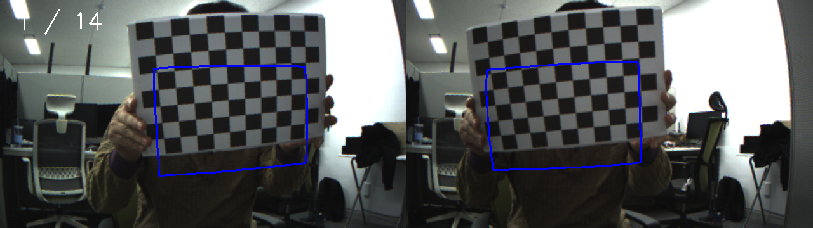
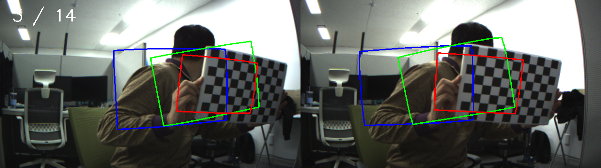
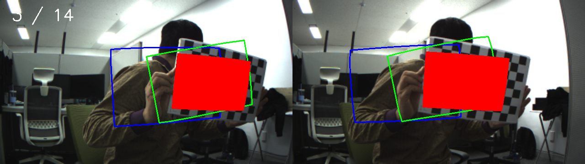
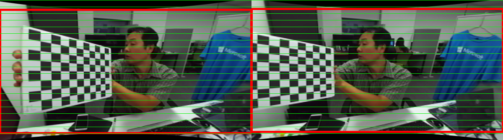
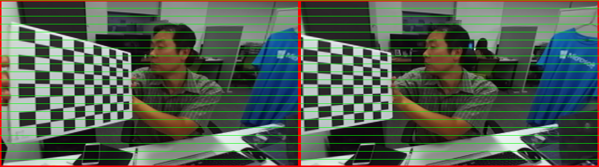
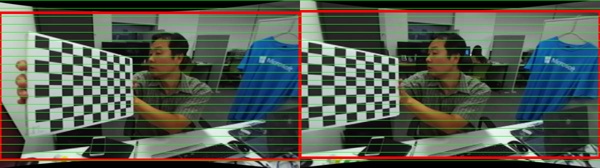
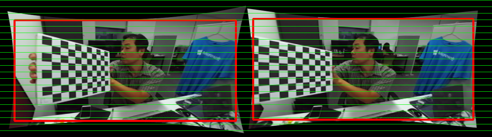

# stereo_mono_camera_calibration
camera calibration for either mono (usb webcam) or stereo cameras (ZED, Withrobot OCAMS etc.).<br/>
```-mono``` is the switching flag.


# Order

### [save_stereo_images] -> [stereo_calib_eyedea] -> [get_rectified_stereo]

# [save_stereo_images]
#### 목적 
모노/스테레오 캘리브레이션을 위해 스테레오 카메라오 부터 **체스보드가 적당히 잘** 보이는 왼쪽/오른쪽 이미지들을 저장하기 위함.  <Fig. 1> 과 <Fig. 2>는 스테레오 카메라로 부터 각각 첫번째와 세번째 체스보드 이미지 쌍을 저장한 직후의 카메라 뷰의 예를 보여 주고 있다.  <Fig. 3>은 세번째 저장된 체스보드 자세와 현재 체스보드의 자세가 비슷하기 때문에 새로운 거리에서 새로운 자세를 취하라는 '경고' 메시지로 filled 된 사각형을 display하고 있다.

#### 빌드
	$ make -f Makefile_save_stereo_images
#### 사용 예
See ``save_stereo_images.sh``<br/>
	
	$ ./save_stereo_images_exe -mono -ocam=1 -cam=1 -s_mm=24.95 -w=10 -h=7 -width=672 -height=376 -image_list=data/stereo_calib_khchoi.xml -show=1 -nr=1 -th_overlap=0.6 -sec_int=7 -dir_img=data
#### 인자들
-mono = flag for mono camera calibration (Don't use for stereo calibration).<br/>
-ocam = zero for non-Withrobot stereo camera. non-zero for Withrobot stereo camera.<br/>
-cam = camera index.<br/>
-s_mm = chessboard grid side length in millimeters.<br/>
-w = # of horizontal grids<br/>
-h = # of vertical grids<br/>
-width = width of left or right camera image<br/>
-height = height of left or right camera image<br/>
-image_list = xml file name where image file names are listed.<br/>
-show = zero for not displaying, non-zero for display<br/>
-nr = short for no-rectification<br/>
-th_overlap = area raitio threshold for overlap check<br/>
-sec_int = seconds for the idle time for next capture<br/>
-dir_img = folder to save the captured images. <br/>   

<Fig. 1> 체스보드 1번째 뷰 저장 직후


<Fig. 2> 체스보드 3번째 뷰 저장 직후


<Fig. 3> 저장된 3번째 뷰와 현재 chessboard 뷰가 비슷할 때 '중복' 경고.


# [stereo_calib_eyedea]
#### 목적 
저장된 (왼쪽/오른쪽) 이미지 쌍들로 부터 (스테레오) 모노 캘리브레이션을 수행하여 intrinsic / extrinsic paramter 들을 구하고 이를 yml 파일로 저장함.
#### 빌드
	$ make -f Makefile_stereo_calib
#### 사용 예
See ``stereo_calib_eyedea.sh``<br/>
	
	$ ./stereo_calib_eyedea_exe -s=24.95 -w=10 -h=7 -dir=data/zed_672x376/ -e=10,8 -input=data/stereo_calib_khchoi.xml
#### 인자들
-mono = flag for mono camera calibration (Don't use for stereo calibration).<br/>
-s = length of the side of the chessboard square in millimeters.<br/> 
-w = # of grid in horizontal side. <br/>
-h = # of grid in vertical side.  <br/>
-e = list of one-based indices to skip.<br/>
-dir = folder where the actual image files are.<br/>
-input = path to the xml file in which image file names are listed.<br/>

# [get_rectified_stereo]
#### 목적 
캘리브레이션 결과 파라미터 파일들(왼쪽/오른쪽 intrinsic parameter들의 yml 파일과, extrinsic paramter들의 yml 파일)로 부터 임의의 왼쪽/오른쪽 이미지 쌍들에 대해 rectified된 이미지들을 구하고 저장함.
#### 빌드 :
	$ make -f Makefile_get_rectified_stereo
#### 사용 예
See ``get_rectified_stereo.sh``<br/>
	
	$ ./get_rectified_stereo_exe -int=data/zed_672x376/intrinsics.yml -ext=data/zed_672x376/extrinsics.yml -post=alfa_1 -input=data/stereo_calib_khchoi.xml -dir=data/zed_672x376/ -sec=1 -alfa=1
#### 인자들

-mono = flag for mono camera calibration (Don't use for stereo calibration).<br/>
-ocam = zero for non-Withrobot stereo camera. non-zero for Withrobot stereo camera.<br/>
-cam = camera index.<br/>
-int = path to the stereo left/right intrinsic parameter yml file <br/>
-ext = path to the stereo extrinsic parameter yml file <br/>
-calib = path to mono calibration parameter yml file <br/>
-alfa = [0 ~ 1 or -1]. The scale factor for undistortion and rectification.  Check <Fig. 4 ~ 7> for the effect of alfa<br/>
-post = postfix for the resulted yml file name. <br/>
-input = path to the xml file where the left and right images are listed. <br/>
-dir = the directory where the resulted rectifed images are supposed to be saved. <br/>
-sec = display interval in seconds. <br/>

<Fig. 4> alfa = -1


<Fig. 5> alfa = 0


<Fig. 6> alfa = 0.5


<Fig. 7> alfa = 1


# All in sequence
#### 사용 예
See ``all_in_sequence.sh``<br/>
```	
IS_OCAM=0

CAM_IDX=0
#CAM_IDX=1

ZED=zed
OCAMS=ocams

#CAMERA=$ZED                                                                                  
#CAMERA=$OCAMS  
CAMERA=logitech_c920  

if [ $CAMERA = $ZED ]; then 
	WIDTH=672
	HEIGHT=376
elif [ $CAMERA = $OCAMS ]; then
	WIDTH=640
	HEIGHT=360
	IS_OCAM=1
else 
	WIDTH=640
	HEIGHT=480
fi
echo "width : $WIDTH , height : $HEIGHT"      
echo "IS_OCAM : $IS_OCAM"   

#fi #[ 1 -eq 0 ]

SQUARE_MM=24.95
WIDTH_CHESS=10    
HEIGHT_CHESS=7
OBJECT=clock
ALPHA=0
SHRINK=0.5

CAM_ENV="$CAMERA"_"$WIDTH"x"$HEIGHT"
echo "CAM_ENV : $CAM_ENV"

CALIB_ENV="$CAM_ENV"_"$WIDTH_CHESS"x"$HEIGHT_CHESS"_"$SQUARE_MM"
echo "CALIB_ENV : $CALIB_ENV"

DIR_STEREO=~/work/eyedea/stereo_camera_calibration/master
#DIR_STEREO=/mnt/d/work/eyedea/stereo_camera_calibration/master
echo "DIR_STEREO : $DIR_STEREO"
[ ! -d "$DIR_STEREO" ] && echo "Error: directory '$DIR_STEREO' does NOT exist." && exit
DIR_CALIB="$DIR_STEREO"/data/"$CALIB_ENV"
echo "DIR_CALIB : $DIR_CALIB"
[ ! -d "$DIR_CALIB" ] && echo "Error: directory '$DIR_CALIB' does NOT exist." && exit

FILE_MONO="$DIR_CALIB"/cam_param_"$CALIB_ENV".yml
echo "FILE_MONO : $FILE_MONO"

FILE_INTR="$DIR_CALIB"/intrinsics_"$CALIB_ENV".yml
echo "FILE_INTR : $FILE_INTR"

FILE_EXTR="$DIR_CALIB"/extrinsics_"$CALIB_ENV".yml
echo "FILE_EXTR : $FILE_EXTR"

FILE_IMG_LIST="$DIR_CALIB"/stereo_image_list_$CALIB_ENV.xml
echo "FILE_IMG_LIST : $FILE_IMG_LIST"
[ ! -f "$FILE_IMG_LIST" ] && echo "$FILE_IMG_LIST does NOT exist." && exit

# 모노 카메라 이미지 저장
echo "save_stereo_images starts."
#$DIR_STEREO/save_stereo_images_exe -ocam=$IS_OCAM -cam=$CAM_IDX -mono -s_mm=$SQUARE_MM -w=$WIDTH_CHESS -h=$HEIGHT_CHESS -width=$WIDTH -height=$HEIGHT -image_list=$FILE_IMG_LIST -dir_img=$DIR_CALIB -th_overlap=0.6 -sec_int=7
echo "save_stereo_images finishes."

# 스테레오 카메라 이미지 저장
echo "save_stereo_images starts."
#$DIR_STEREO/save_stereo_images_exe -ocam=$IS_OCAM -cam=$CAM_IDX -s_mm=$SQUARE_MM -w=$WIDTH_CHESS -h=$HEIGHT_CHESS -width=$WIDTH -height=$HEIGHT -image_list=$FILE_IMG_LIST -dir_img=$DIR_CALIB -th_overlap=0.6 -sec_int=7
echo "save_stereo_images finishes."

echo "stereo_calib_eyedea starts."
# 스테레오 카메라 캘리브레이션
#$DIR_STEREO/stereo_calib_eyedea_exe -alfa=$ALPHA -s=$SQUARE_MM -w=$WIDTH_CHESS -h=$HEIGHT_CHESS -dir_img=$DIR_CALIB -dir_calib=$DIR_CALIB -input=$FILE_IMG_LIST -postfix=$CALIB_ENV                                   
# 모노 카메라 캘리브레이션
#$DIR_STEREO/stereo_calib_eyedea_exe -mono -alfa=$ALPHA -s=$SQUARE_MM -w=$WIDTH_CHESS -h=$HEIGHT_CHESS -dir_img=$DIR_CALIB -dir_calib=$DIR_CALIB -input=$FILE_IMG_LIST -postfix=$CALIB_ENV                                   
echo "stereo_calib_eyedea finishes."

echo "get_rectified_stereo starts."
#   image file version 
#$DIR_STEREO/get_rectified_stereo_exe -input=$FILE_IMG_LIST -int=$FILE_INTR -ext=$FILE_EXTR -alfa=$ALPHA -post=alfa_$ALPHA -sec=1 -dir_img=$DIR_CALIB -dir_rect=$DIR_CALIB/rectified_result                                                                    
$DIR_STEREO/get_rectified_stereo_exe -mono -input=$FILE_IMG_LIST -calib=$FILE_MONO -alfa=$ALPHA -post=alfa_$ALPHA -sec=10 -dir_img=$DIR_CALIB -dir_rect=$DIR_CALIB/rectified_result                                                                    
#   camera version
#$DIR_STEREO/get_rectified_stereo_exe -ocam=$IS_OCAM -mono -cam=$CAM_IDX -width=$WIDTH -height=$HEIGHT -int=$FILE_INTR -ext=$FILE_EXTR -alfa=$ALPHA -post=alfa_$ALPHA -sec=1 -dir_rect=$DIR_CALIB/rectified_result
echo "get_rectified_stereo finishes."
```

#### 인자들
CAMERA = currently one of [zed, ocams] <br/>
WIDTH = width of left or right camera image <br/>
HEIGHT = width of left or right camera image <br/>
SQUARE_MM = chessboard grid side length in millimeters. <br/>
WIDTH_CHESS = # of grid in horizontal side of chessboard. <br/>
HEIGHT_CHESS = # of grid in vertical side of chessboard. <br/>
CAM_IDX = camera index. <br/>
IMAGE_XML = path to xml file where image file names are listed <br/>
DIR = folder where actual left/right image and calibration parameter files are saved. <br/> 
ALPHA = [0 ~ 1 or -1]. The scale factor for undistortion and rectification.<br/>

#### TODO
* calibration 부분을 Octave 코드로 대체
* Octave 코드로 대체하면 findChessboard 부분이 필요없으므로 대충의 chessboard를 잡는 알고리듬만 필요.
